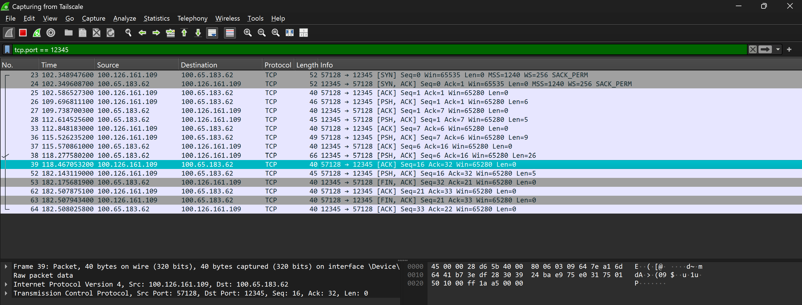
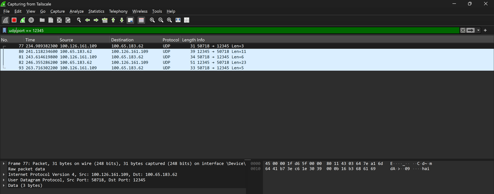

## Network Traffic Analysis (Wireshark)

To verify the correct implementation of our client-server chat application over the Tailscale VPN (`100.x.x.x` subnet), traffic was monitored using Wireshark. Below are the captures for both the TCP and UDP implementations.

### 1. TCP Socket Communication

**Explanation:**
This capture demonstrates a connection-oriented TCP session on port `12345`. 
* [cite_start]**Connection Establishment:** The first three packets (Frames 23, 24, and 25) clearly show the standard TCP 3-way handshake (`SYN`, `SYN-ACK`, `ACK`) establishing a reliable connection between the client (`100.126.161.109`) and the server (`100.65.183.62`)[cite: 45]. 
* **Data Transfer:** Following the handshake, data is exchanged using packets with the `PSH, ACK` flags set, meaning data is being pushed to the application layer. [cite_start]Notice that every data packet sent is followed by an `ACK` packet from the other side, confirming successful receipt[cite: 44].
* [cite_start]**Connection Teardown:** At the end of the capture (Frames 53, 62, 63, 64), the communication is gracefully closed using packets with the `FIN, ACK` flags set, indicating that both sides agree to terminate the connection[cite: 49].

### 2. UDP Socket Communication

**Explanation:**
This capture demonstrates the connectionless nature of User Datagram Protocol (UDP) on port `12345`.
* [cite_start]**No Handshake:** In contrast to the TCP capture, there is no 3-way handshake to establish a connection[cite: 54]. As soon as the application is ready, the data is immediately sent over the wire (Frame 77).
* [cite_start]**No Acknowledgements:** There are no `ACK` packets visible[cite: 54]. [cite_start]The sender simply fires the datagrams to the destination address without waiting for any confirmation that they arrived, highlighting UDP's lack of guaranteed delivery[cite: 51, 52].
